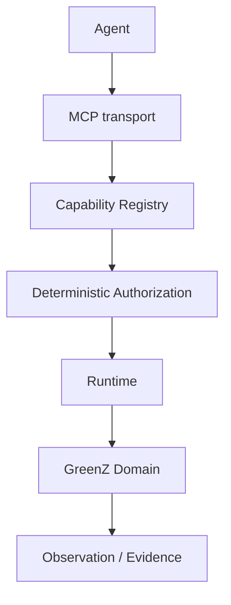

# GAIEP Capability MCP Architecture

## Capability Model

Runtime VNext capabilities are stable, versioned declarations. A capability declares identity, access mode, risk, required scopes, allowed runtime, schema refs, audit/provenance requirements, source semantics, and availability. Registration never grants permission and never exposes arbitrary Python callables as capabilities. Execution remains behind Runtime.

## Registry

`CapabilityRegistry` is deterministic and immutable after construction. It rejects duplicate `(capability_id, version)` identities, supports explicit version lookup, fails unknown versions closed, and enumerates sorted identities for reproducible audits.

## Authorization Boundary

Authorization remains the existing Runtime VNext policy path. Effective authority is the intersection of authority scope, capability registry, task policy, skill manifest, workspace scope, global policy, runtime budget, and parent authority constraints. Default is deny: unknown capability, version mismatch, unsupported access mode, workspace violation, budget exhaustion, task denial, skill denial, and forbidden future actions do not execute.

## MCP Transport Boundary

`McpCapabilityGateway` is transport glue. It translates an MCP request into a versioned capability request, resolves the capability, delegates the decision to `authorize_with_policy`, and only then invokes `LocalRuntime`. It does not choose models/providers, call domain providers directly, execute Python, shell, SQL, or broker operations, or own business authorization logic.

## Runtime Boundary

Successful MCP requests become `ActionType.CAPABILITY_READ` actions and produce typed `ObservationType.CAPABILITY_RESULT` observations. Runtime events remain reconstructible by `run_id`, `request_id`/`action_id`, authorization events, action events, observation events, artifact refs, and evidence refs.

## Read-Only Capability Catalog

The catalog reserves these read-only GreenZ capability identities:

- `market.get_snapshot`
- `market.get_quote`
- `market.get_candles`
- `measurements.get_snapshot`
- `measurements.get_breadth`
- `measurements.get_options_state`
- `forecast.get_current`
- `forecast.get_history`
- `strategy.get_state`
- `risk.get_state`
- `portfolio.get_positions`

In this ChatGPT lab checkout, all GreenZ domain capabilities are declared unavailable because the authoritative production domain interfaces are absent. This preserves stable IDs and schemas without fabricating data providers.

## Request and Evidence Lifecycle

Large payloads must be represented through artifact refs. The MCP response and Runtime observation carry evidence refs and artifact refs rather than duplicating large result content into event history.

## Security Invariants

- MCP is not an authority layer.
- A tool is not a capability, and a capability is not permission.
- LLM-provided risk metadata is advisory only.
- Unknown and malformed requests fail closed.
- Denied requests do not invoke Runtime execution or resolvers.
- Resolver/provider failures do not become successful observations.
- MCP errors are sanitized and do not leak local filesystem paths or secrets.

## Unavailable Future Actions

The following future action namespaces are reserved and explicitly unavailable/forbidden in this phase:

- `trade.submit`
- `trade.cancel`
- `trade.modify`
- `trade.flatten`

Requests for these capabilities return deterministic denial. No broker execution, order submission, cancellation, modification, flattening, live trading, arbitrary Python, arbitrary shell, or arbitrary SQL is implemented.

## OpenHands Boundary

Adopted patterns: agent/runtime separation, action/observation loop, explicit execution boundary, workspace isolation, typed security decisions, and reconstructible execution history.

Rejected in this phase: OpenHands UI/server architecture, Docker orchestration, product-specific server shape, autonomous swarms, and unrelated dependencies.

## Hermes Compatibility

The contracts remain compatible with future ContextEngine, GreenSkills, GreenMemory, and bounded subagent layers. This task does not implement the full Hermes-derived memory/context/subagent stack. Parent/child authority subset checks remain enforceable before execution.

## Remaining Gaps

Full GreenZ domain integration is blocked in this checkout because authoritative market, measurement, forecast, strategy, risk, portfolio, certification, correction-capture, Gateway/provider failover, and production provenance interfaces are absent. The generic governed capability and MCP boundary is implemented and tested without fabricating those surfaces.
